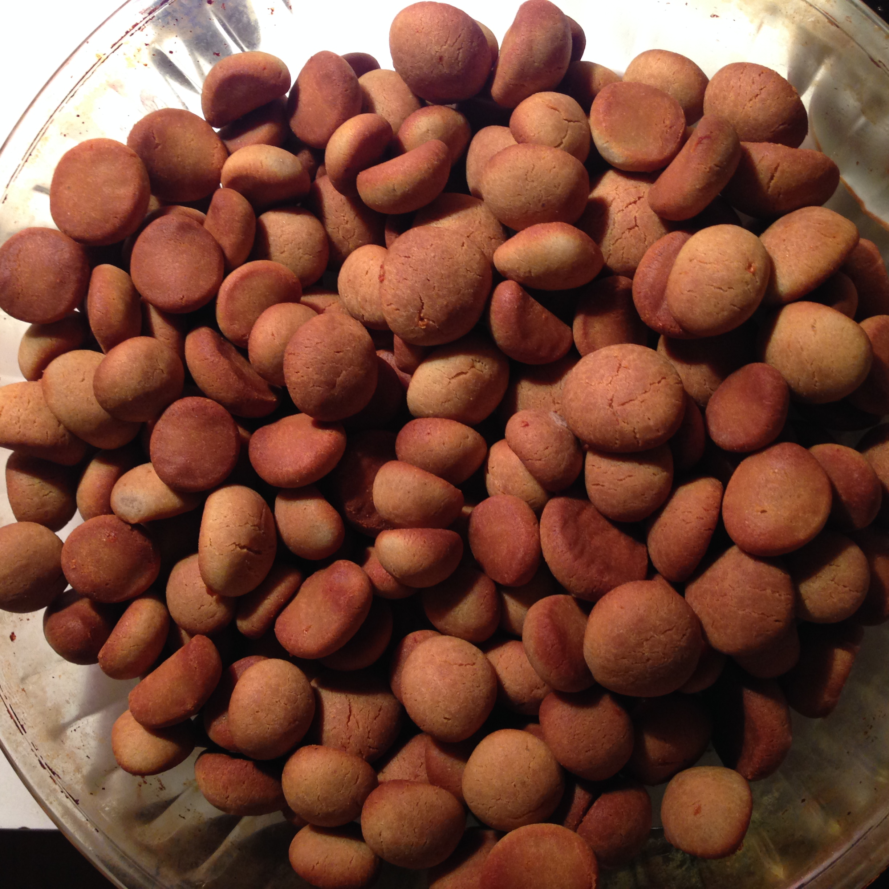
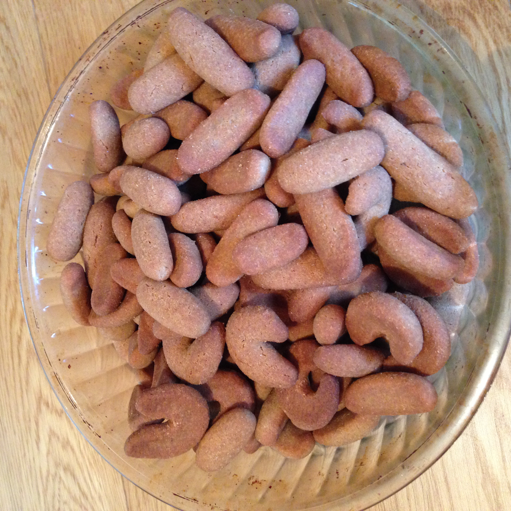

Tatraküpsised
===========
    2014-11-21

- 100g võid
- 25g suhkrut
- 1 muna
- 150g tatrajahu
- veidi soola, paar tera sidrunhapet

Ei vett, ei küpsetuspulbrit. Sega kõik kokku, jaga pätsikesteks.
~20min@180°C

### Advendi puhul väiksema kalorsusega versioon
    2014-11-30

- 200g võid
- 60g suhkrut
- 2 muna
- 350g tatrajahu
- sool

Olen proovinud erisuguse kujuga küpsiseid; suupäraseimaks on osutunud pisikesed peopesas veeretatud kuulikesed.
Esimese plaaditäie panin külma, järgmised juba kuuma ahju. Tulemust see kuidagipidi ei mõjutanud.
180°C ja ~20 (+5 külma ahju puhul) minutit.

### Talujahu
    2014-12-05

Meil käib aegajalt üks talumees kraami toomas. Seekord saime tatrajahu.
Taigen ja küpsised tulid kardinaalselt erinevad; taigen kleepis kausi külge aga käte külge sugugi mitte ja pätsikeste tegemine oli palju mõnusam.
Valmis küpsised krõbisevad hamba all vähem, kui poejahust. Maitsestasin sedasi, et pooled küpsised said poole küpsemise peal igaüks tilga lahjendatud mett kuklale. Näeb ilus välja ja kompenseerib liiga vähest suhkrukogust retseptis.
Hästi mõjus ka see, et raputasin valmis küpsiste kaussi veits soola peale.

### Toorjuust
    2014-12-07

- 50g võid
- 100g toorjuustu (kārums)
- 50g mett
- 1 muna
- 210g tatrajahu
- 5g soola

### Lepasuitsujuust
    2014-12-10

- 200g võid
- 200g riivitud lepasuitsujuustu
- 100g suhkrut
- 4 muna
- 600g tatrajahu
- 10g soola

Seekord jälle tavaline tatrajahu - taigen tuleb hästi lahti kausi küljest aga pätse teha märksa ebamugavam. Need küpsised hakkavad mulle juba meeldima; suitsumaitse on hea, magusat võiks tiba vähem olla.

### Juust toorjuust talujahu
##### Mahe tatrajahu, Tõrvaaugu talu
    2014-12-17

- 300g võid
- 200g riivjuustu
- 175g toorjuustu
- 660g tatrajahu
- 6 muna
- 15g soola

Erakordselt kleepuv taigen. Arvan, et sõtkusin teda oma tund aega enne kui veidi käte küljest lahti tulema hakkas. Samas pätsiveeretamisel sai jällegi puhaste kätega hakkama. Huvitav, mis on see oluline vahe, miks tavaline tatrajahu moodustab kätele sihukese liimikihi ja see mahe, kleepuv talujahu jätab käed puhtaks.  
Aga oi ku head. Seni parimad! Suhkru puudumine tunda ei anna. Toorjuust täitsa äratuntav. Võid oli tiba palju - küpsised ujusid nati rohkem kui tarvis.

### Küüslauk :p
    2014-12-20

- 600g võid
- 100g riivjuustu-~~küüslaugu~~ segu
- 675g tatrajahu
- 6 muna
- 15g soola
- 20g suhkrut

Selgus, et ma unustasin siiski küüslaugu (enamuse sellest). Samuti tüdisin pabulatest - saagu korralikud junnid. Küpsetasin seekord veidi vähem, küpsis sai vähem kõva ja süües meenutab vägagi tatraputru - üllatus.

