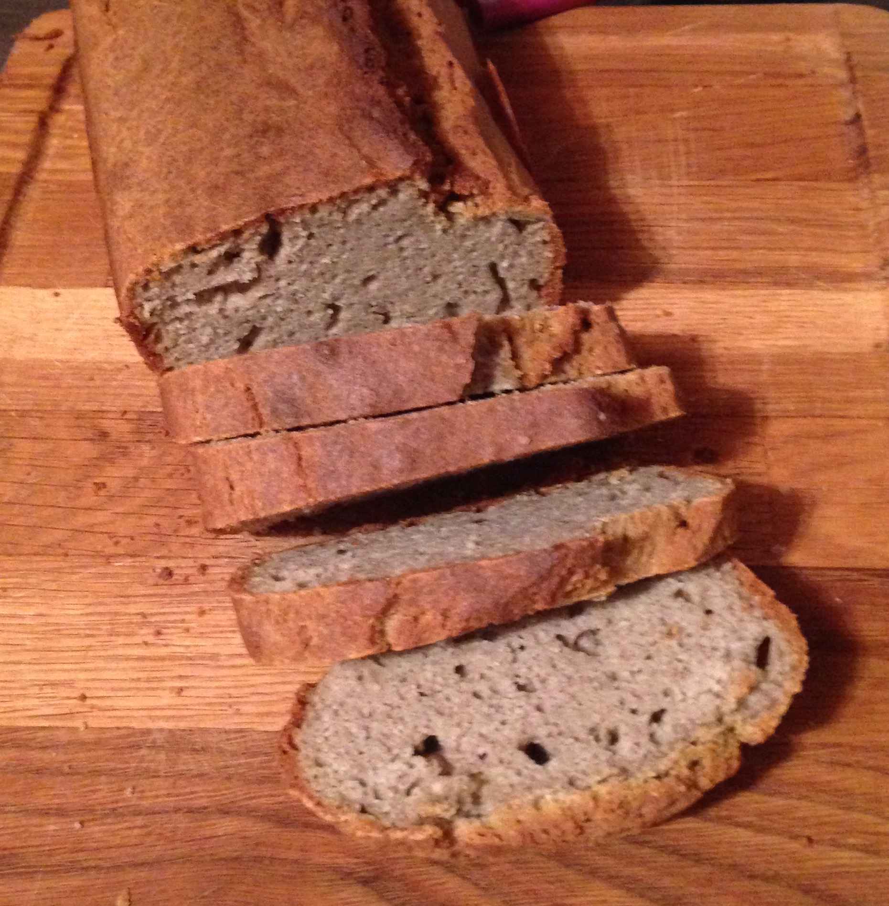

Tatraleib
===========
    2015-01-27

|       aine | kogus  |   g |
|-----------:|-------:|----:|
|  tatrapüül | 5,5 dl | 390 |
|     keefir |   3 dl | 320 |
|        õli |   1 dl |  80 |
|       muna |   3 tk | 175 |
|       sool | 1,5 tl |  |
|      sooda |   1 tl |  |

45 minutit eelkuumutatud ahjus ~220°C

Taigen on rammusa hapukoore paksune, kergelt voolav.  
Ahjust tulnud leib lõhnab oivaliselt - veidi magusalt, kuigi mingeid magusaineid ei lisanud.

Väga õhukese koorikuga, hästi kerkinud ja läbi küpsenud õlimaitseline tatrapuder. Maitse asi.
