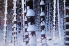
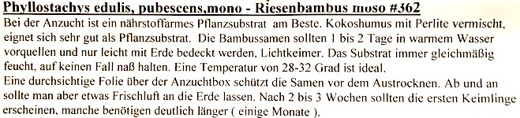
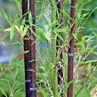
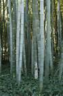
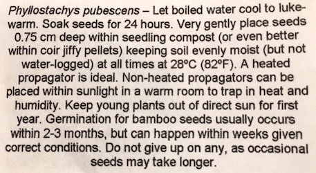
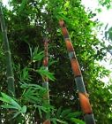

## #1 Giant Bamboo Pubescens, Moso, Hardy To -20 Degrees C
 

- seller: http://www.ebay.com/usr/seedsandmore12.12?_trksid=p2057872.m2749.l2754
- code: 261800912070
- seeds: 20

## #2 Black Bamboo Seeds Phyllostachys Pubescens Hardy Hedging Green Tree Garden

- seller: http://www.ebay.com/usr/cskwin2015?_trksid=p2057872.m2749.l2754
- code: 321819426980
- seeds: 40

## #3 Phyllostachys pubescens (Moso Silver Bamboo)
 

- seller: http://www.ebay.com/usr/the-botanical-rarity-shop?_trksid=p2057872.m2749.l2754
- code: 281600484507
- seeds: 20

## #4 Dendrocalamus grandis - Extremely Rare Giant Bamboo
 

- seller: http://www.ebay.com/usr/the-botanical-rarity-shop?_trksid=p2057872.m2749.l2754
- code: 281676202931
- seeds: 10

